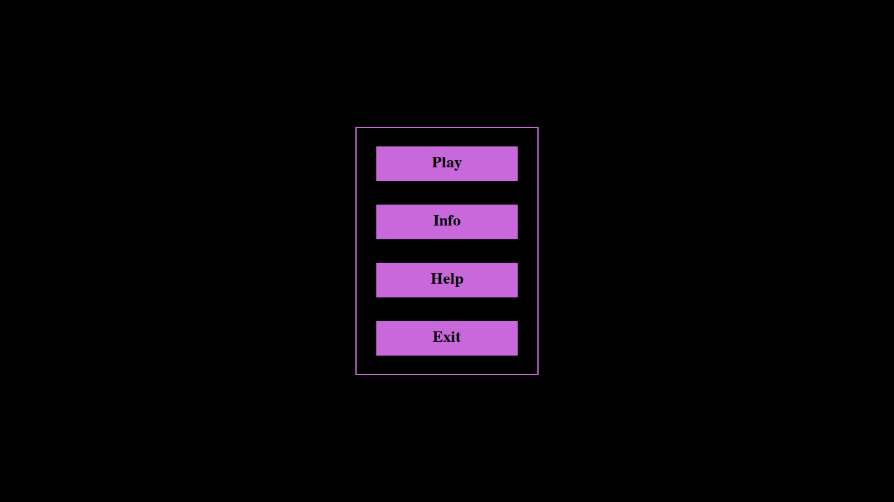
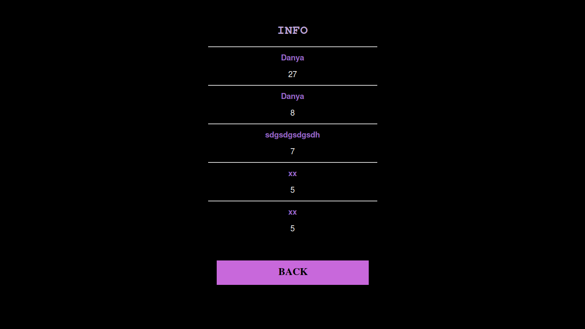
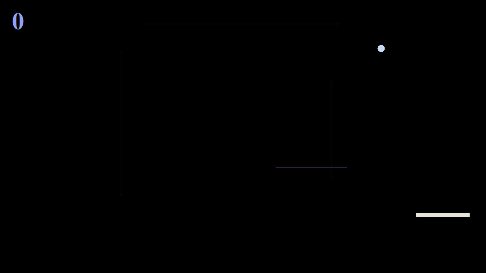
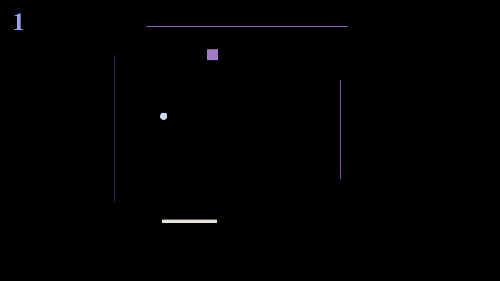
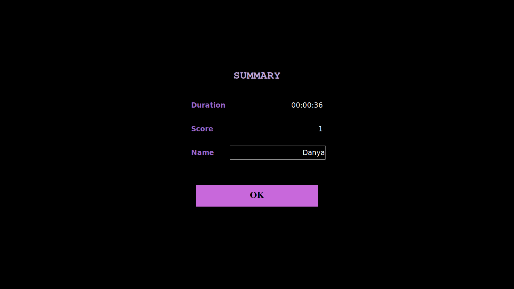

# PingPong
It's a classic 2D game, where you're to hit the ball using paddle. Use left and right arrows to move your tool.
 
This app's worth your attention because of:
- Simple user-friendly design
- Minimalistic color scheme
- Realistic game physics
- Unpredictable game's generators

Don't stay, score, compete and survive!

## Visuals






## Installation
First of all, you need to do the following commands if you don't have 
[pyyaml](https://pyyaml.org/wiki/PyYAMLDocumentation) and 
[tk](https://wiki.python.org/moin/TkInter) packages installed.
```bash
$ pip install pyyaml
$ pacman -S tk
```

## Usage
At the project's root directory type the following:
```bash
$ python app.py
```

## Contributing
Pull requests are welcome. For major changes, please open an issue first to discuss what you would like to change.

## Authors and acknowledgement
- Danylo Petrakivskyi, a fresher from KNU, Kyiv
- Mykola Morgunenko, a fresher from UCU, Lviv
- Alexei Bychkov, a professor from KNU, Kyiv

## Licence
[MIT](https://choosealicense.com/licenses/mit/)